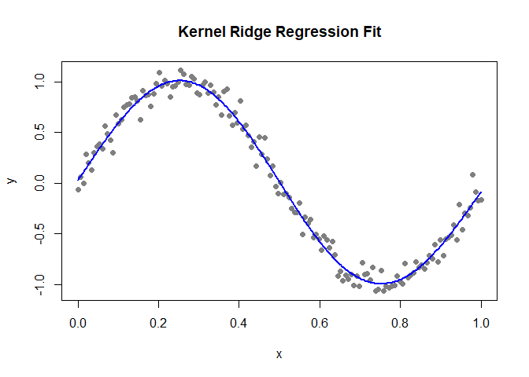

<!-- README.md is generated from README.Rmd. Please edit that file -->

# asa.rosie

<!-- badges: start -->

<!-- badges: end -->

The **asa.rosie** package provides a simple implementation of **Kernel
Ridge Regression (KRR)**  
using a Gaussian kernel. It allows users to easily fit nonlinear
regression models  
and generate predictions for new data.

The goal of asa.rosie is to …

## Installation

You can install the development version of asa.rosie from
[GitHub](https://github.com/) with:

``` r
# install.packages("pak")
pak::pak("LJWstat/asa.rosie")
```

## Example

This is a basic example which shows you how to solve a common problem:

Here is a minimal example showing how to:

1.  simulate nonlinear regression data

2.  fit a KRR model

3.  compute predictions

4.  visualize the fitted curve

``` r
library(asa.rosie)
## basic example code
library(asa.rosie)

set.seed(1)
n  <- 150
x  <- seq(0, 1, length.out = n)
y  <- sin(2 * pi * x) + rnorm(n, sd = 0.1)

X <- matrix(x, ncol = 1)
```

### Fit KRR model

``` r
model <- krr(X, y, rho = 5, lambda = 0.01)
```

### New data for prediction

``` r

x_new  <- seq(0, 1, length.out = 300)
X_new  <- matrix(x_new, ncol = 1)

y_pred <- predict(model, X_new)
```

### Plotting the Results

``` r
plot(x, y, pch = 16, col = "gray50",
main = "Kernel Ridge Regression Fit",
xlab = "x", ylab = "y")
lines(x_new, y_pred, col = "blue", lwd = 2)
```



The blue line represents the KRR regression estimate.
